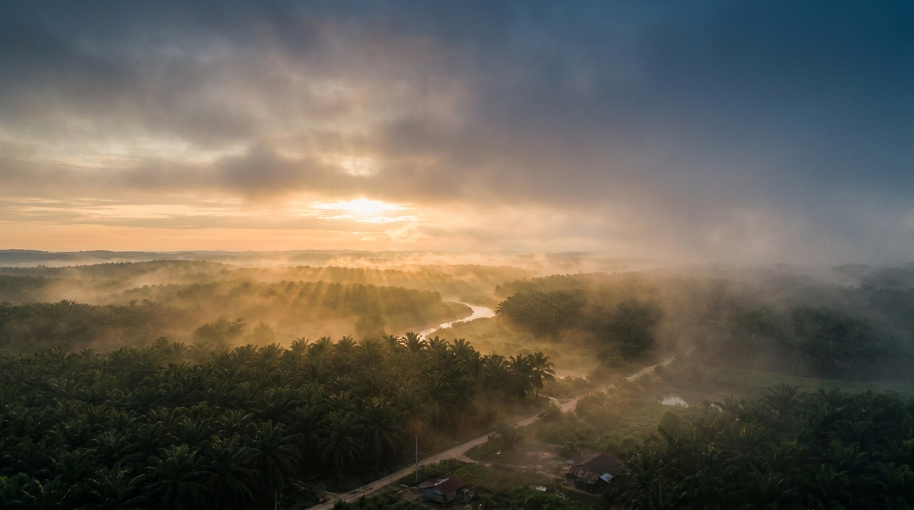

<div align="center">
  <br />
  
  <br />
  <br />

  <h1>🌿 Desa Air Putih Digital Experience</h1>
  <p>
    <strong>A premium, editorial-style digital profiling website for Desa Air Putih, Indragiri Hulu, Riau.</strong><br/>
    <em>Menyusuri narasi kehidupan, harmoni alam, dan warisan budaya di tepian Sungai Indragiri.</em>
  </p>

  <p>
    <a href="https://react.dev"></a>
    <a href="https://vitejs.dev"></a>
    <a href="https://tailwindcss.com"></a>
    <a href="https://www.typescriptlang.org/"></a>
  </p>
</div>

<br />

## 📖 Architecture & Philosophy

This project is built from scratch following strict **Senior Frontend Architect** directives to ensure enterprise-grade scalability:
- ✨ **System Over Page Optimization:** Optimizes for the entire system ecosystem, not individual screenshots.
- 🏗️ **Architecture First:** Scalability and maintainability prioritized over premature visual polish.
- 🎨 **The Figma Philosophy:** Initial designs were used strictly as visual references. No generated HTML/CSS was copied or referenced.

### 🎭 Design Philosophy
- **Editorial Experience:** Typography-first design inspired by National Geographic and museum exhibitions.
- **No Glassmorphism:** We avoid trendy SaaS aesthetics (heavy shadows/glassmorphism) to maintain a timeless, calm, and grounded feel.
- **Photography First:** Large, stunning photography is the hero. The UI steps back to let the content shine.
- **Storytelling:** The website acts as a visual and textual journey through Desa Air Putih, not just an information directory.

---

## 📂 Project Structure

A highly scalable Feature-Based Architecture:

```text
src/
├── app/                  # Providers, Router, Root App Component
├── layout/               # RootLayout and EditorialLayout wrappers
├── components/           # Reusable UI abstractions (Container, Section, EditorialImage)
├── features/             # Modular Feature Architecture (e.g. Home, Gallery, History)
├── design/               # Centralized Design Tokens (colors, spacing, elevation)
├── content/              # Headless Static Content layer
└── docs/adr/             # Architecture Decision Records
```

---

## 🚀 Getting Started

To run this project locally:

1. **Clone the repository:**
   ```bash
   git clone https://github.com/Erliandikasyahputraa/web-profil-inhu-kkndesaputih.git
   cd "Desa Air Putih Digital Experience"
   ```

2. **Install dependencies (using pnpm):**
   ```bash
   pnpm install
   ```

3. **Start the development server:**
   ```bash
   pnpm dev
   ```

---

## 🛡️ Quality Gate (Definition of Done)
- ✅ **TypeScript:** Zero `any` types or strict mode errors.
- ✅ **ESLint:** Passes all linting rules.
- ✅ **Build:** Production build succeeds (`pnpm build`).
- ✅ **Responsive:** Perfect rendering across breakpoints (360px to 1536px).
- ✅ **Accessible:** ARIA labels, semantic HTML, and proper contrast.

---

## 🔮 Future Ready Roadmap
- 📝 **CMS Ready:** Content layer already isolated.
- 🌐 **i18n Ready:** Texts extracted to variables, allowing easy dictionary swaps.
- 📱 **PWA Ready:** Base manifest initialized.
- 📰 **Blog Ready:** Component architecture supports generic markdown rendering layouts.
- 🔗 **API Ready:** Architecture supports dropping in external data fetching via Hooks seamlessly.

---

<div align="center">
  <p>Built with ❤️ for <strong>Desa Air Putih</strong>.</p>
</div>
